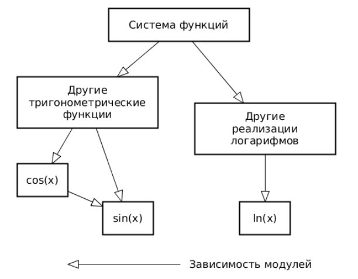

## Лабораторная работа №2

#### Вариант 5219592

Провести интеграционное тестирование программы, осуществляющей вычисление системы функций (в соответствии с вариантом).

x <= 0 : (((((((cos(x) + tan(x)) * sec(x)) * sec(x)) + sin(x)) ^ 3) - tan(x)) * (((((csc(x) / cos(x)) ^ 2) / csc(x)) ^ 2) ^ 2))

x > 0 : (((((log_2(x) * log_3(x)) * log_2(x)) / log_3(x)) + log_2(x)) / (log_2(x) - log_3(x)))

Правила выполнения работы:

1. Все составляющие систему функции (как тригонометрические, так и логарифмические) должны быть выражены через базовые (тригонометрическая зависит от варианта; логарифмическая - натуральный логарифм).
2. Структура приложения, тестируемого в рамках лабораторной работы, должна выглядеть следующим образом (пример приведён для базовой тригонометрической функции sin(x)):

3. 
4. Обе "базовые" функции (в примере выше - sin(x) и ln(x)) должны быть реализованы при помощи разложения в ряд с задаваемой погрешностью. Использовать тригонометрические / логарифмические преобразования для упрощения функций ЗАПРЕЩЕНО.
5. Для КАЖДОГО модуля должны быть реализованы табличные заглушки. При этом, необходимо найти область допустимых значений функций, и, при необходимости, определить взаимозависимые точки в модулях.
6. Разработанное приложение должно позволять выводить значения, выдаваемое любым модулем системы, в сsv файл вида «X, Результаты модуля (X)», позволяющее произвольно менять шаг наращивания Х. Разделитель в файле csv можно использовать произвольный.